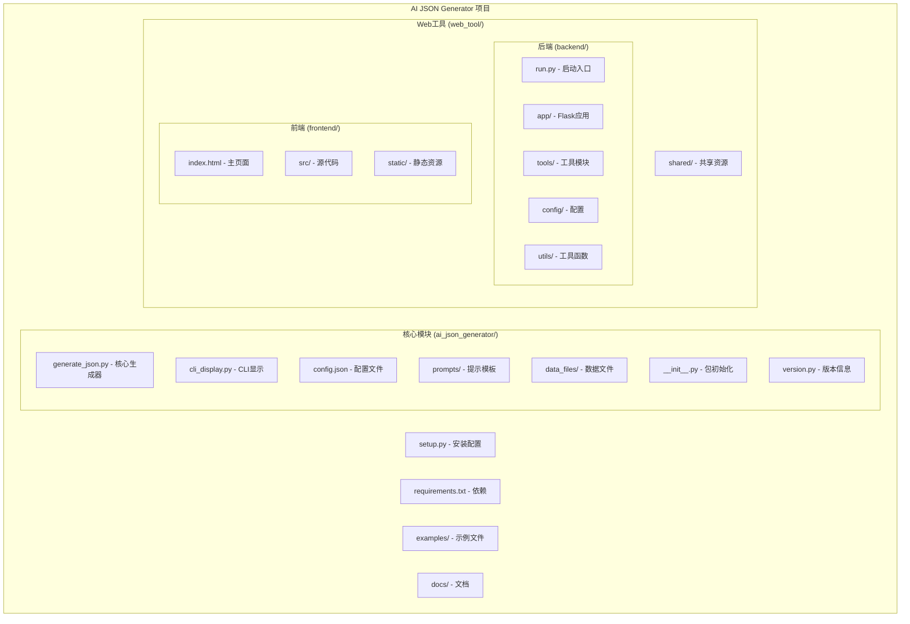
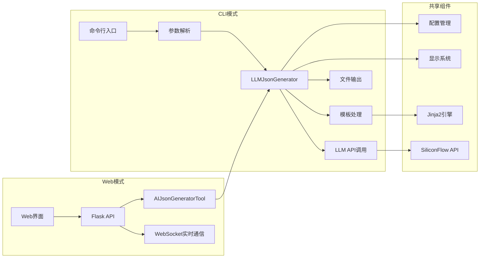
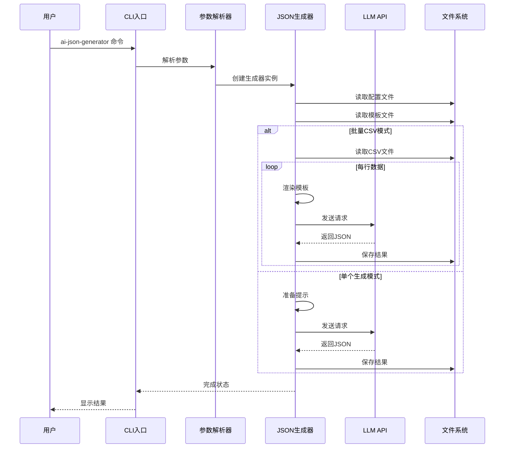
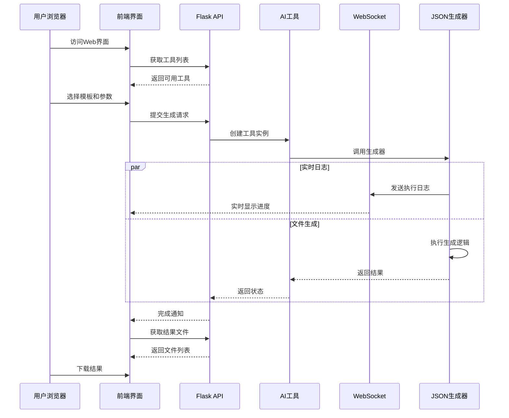

# AI JSON 生成器工具 - 架构说明文档

## 工具概述

AI JSON 生成器是一个基于模板生成AI模型JSON描述的工具，专门为ONNX NPU算子测试用例设计。该工具提供了命令行界面(CLI)和Web界面两种使用方式，支持单个和批量生成测试用例。

## 项目整体架构

### 模块结构图



### 核心组件说明

#### 1. CLI核心模块 (ai_json_generator/)
- **generate_json.py**: 主要的JSON生成器类，包含LLM调用逻辑
- **cli_display.py**: 命令行显示和日志处理
- **prompts/**: 存储Jinja2模板文件
- **data_files/**: 存储测试点和图模式等数据文件
- **config.json**: 默认配置，包含API密钥和模型设置

#### 2. Web工具模块 (web_tool/)
- **backend/**: Flask后端，提供REST API和WebSocket
- **frontend/**: 现代化Web界面
- **shared/**: 模板、上传文件和输出文件的共享目录

## 调用关系图



## 执行时序图

### CLI执行流程



### Web执行流程



## 主要功能模块

### 1. 模板系统
- 基于Jinja2的模板引擎
- 支持变量替换和条件逻辑
- 模板文件存储在`prompts/`目录

### 2. 数据处理
- CSV批量处理支持
- 测试点和图模式数据管理
- 支持断点续执行

### 3. LLM集成
- 默认使用SiliconFlow API
- 支持多种模型选择
- 自动重试和错误处理

### 4. 文件管理
- 自动创建输出目录
- 支持多种输出格式
- 文件压缩和批量下载

### 5. 实时监控
- WebSocket实时日志
- 进度跟踪
- 执行状态管理

## 工具用法介绍

### CLI命令行用法

#### 基本用法
```bash
# 生成单个算子测试用例
ai-json-generator MatMul -o outputs

# 生成多个算子测试用例  
ai-json-generator "MatMul Add Slice" -o outputs

# 使用直接提示文件
ai-json-generator --direct-prompt prompt.txt -o outputs

# 批量生成（CSV模式）
ai-json-generator --batch-csv data.csv --direct-prompt template.txt -o outputs

# 转换为ONNX模型
ai-json-generator MatMul -o outputs --convert-to-onnx

# 调试模式
ai-json-generator MatMul -o outputs --debug --verbose
```

#### 主要参数说明
| 参数 | 说明 |
|------|------|
| `operator` | 算子名称，支持多个算子 |
| `-o, --output` | 输出目录 |
| `--batch-csv` | 批量生成的CSV文件路径 |
| `--direct-prompt` | 直接使用的提示文件路径 |
| `--convert-to-onnx` | 转换为ONNX模型 |
| `--max-retries` | 最大重试次数 |
| `--debug` | 启用调试模式 |
| `--verbose` | 详细模式 |

### Web界面用法

#### 启动Web服务
```bash
cd web_tool/backend
pip install -r requirements.txt
python run.py
```

#### 功能特性
1. **模板管理**: 在线编辑和预览Jinja2模板
2. **CSV数据处理**: 支持文件上传和在线编辑
3. **实时监控**: WebSocket实时显示执行日志
4. **结果管理**: 在线查看、下载单个文件或批量下载
5. **参数配置**: 图形化界面配置生成参数

#### 使用步骤
1. 访问 `http://localhost:5000`
2. 选择工具（AI JSON Generator）
3. 上传或选择模板文件
4. 配置生成参数
5. 上传CSV数据（批量模式）或填写变量值（单个模式）
6. 点击执行生成
7. 实时查看执行日志
8. 下载生成的结果文件

### 配置说明

#### config.json配置文件
```json
{
    "api_base": "https://api.siliconflow.cn/v1/chat/completions",
    "api_token": "your_api_token_here",
    "model": "deepseek-ai/deepseek-coder",
    "temperature": 0.7,
    "max_tokens": 4096
}
```

#### 环境变量
- `AI_JSON_GENERATOR_CONFIG`: 指定配置文件路径
- `SILICONFLOW_API_TOKEN`: API令牌

### 批量处理模式

使用CSV文件进行批量处理时[[memory:7254196]]，工具会：
1. 读取CSV文件的表头作为模板变量
2. 逐行处理数据，为每行生成一个测试用例
3. 支持断点续执行，避免重复处理
4. 自动创建以行号命名的输出目录

### 输出结果

生成的文件包括：
- `*.json`: 生成的JSON测试用例
- `*.onnx`: 转换后的ONNX模型（如果启用转换）
- `prompt_*.txt`: 调试模式下保存的提示文件
- `response_*.txt`: 调试模式下保存的响应文件

## 扩展性

### 添加新工具
1. 在`web_tool/backend/tools/`创建新工具类
2. 继承`BaseTool`基类
3. 实现必要的方法
4. 在配置文件中注册新工具

### 自定义模板
1. 在`prompts/`目录添加新的`.prompt`文件
2. 使用Jinja2语法编写模板
3. 在Web界面中选择使用

### API扩展
Web工具提供完整的REST API，支持：
- 工具管理
- 模板操作
- 文件上传下载
- 执行控制
- 结果查询

这个工具为ONNX算子测试用例的生成提供了完整的解决方案，支持从简单的命令行使用到复杂的批量处理和Web界面操作。
